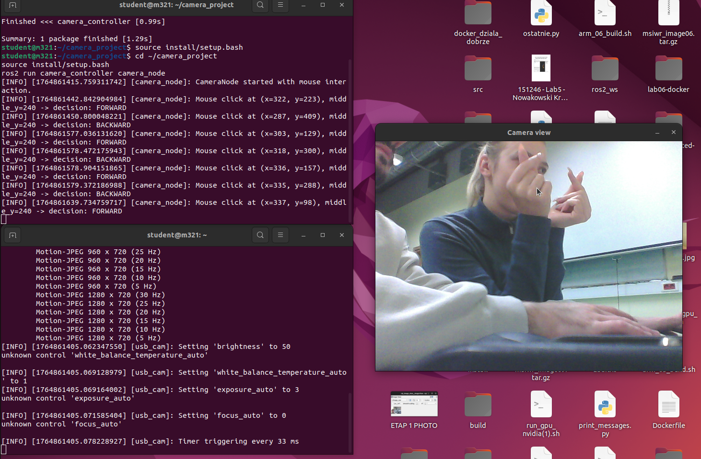
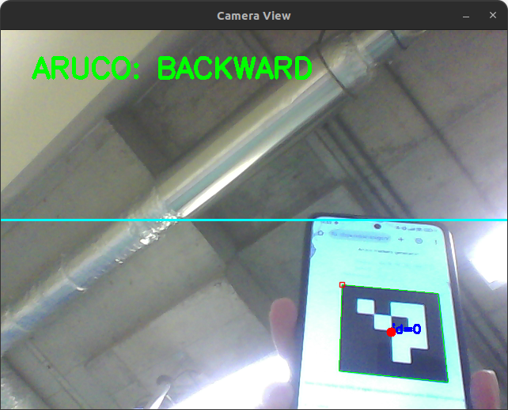

Detailed setup and run instructions are available in `instructions.pdf`.

This project was made by **Martyna Rydczak** and **Piotr Trusiewicz** 

## Stage 1 — Camera Setup Complete

We connected a USB camera and verified the ROS 2 video stream.

- Installed `usb_cam`
- Installed `rqt_image_view`
- Verified that the camera driver publishes `/image_raw`
- Confirmed the live preview in `rqt_image_view`

**Screenshot (Stage 1):**  

## Stage 2 — Custom ROS 2 Camera Node

We implemented a custom ROS 2 node (`camera_node.py`) that:

- subscribes to `/image_raw`,
- converts `sensor_msgs/Image` to OpenCV format using `CvBridge`,
- displays the live camera stream in an OpenCV window,
- operates in real time.

**Screenshot (Stage 2):**  

## Stage 3 — Mouse-based interaction

We extended `camera_node.py` to support mouse-based interaction in the camera window.

Functionality:
- left mouse button clicks are captured in the OpenCV window,
- the click position is compared with the vertical center of the image,
- a control decision is generated:
  - click above the image center → **FORWARD**
  - click below the image center → **BACKWARD**

**Screenshots (Stage 3):**

*Click above image center — FORWARD*  

*Click below image center — BACKWARD*  

## Stage 4 — Robot control (turtlesim)

In this stage we connected the camera-based decision logic with robot control in `turtlesim`.

- Robot: `turtlesim_node`
- Control topic: `/turtle1/cmd_vel` (`geometry_msgs/Twist`)
- Our node `camera_node.py`:
  - subscribes to `/image_raw`,
  - processes mouse clicks in the camera window,
  - generates a decision:
    - click above image center → **FORWARD** → `linear.x = 1.0`
    - click below image center → **BACKWARD** → `linear.x = -1.0`
  - publishes `Twist` commands to `/turtle1/cmd_vel`, which makes the turtle move forward / backward.

**Screenshots (Stage 4):**

*FORWARD (linear.x > 0)*  

*BACKWARD (linear.x < 0)*  

## Stage 5 – Automatic launch (+0.5)

In this stage we prepared an automatic startup of the whole system using a ROS 2 launch file and a simple shell script.

The script:
- sets the required environment variable `ROS_DOMAIN_ID=0`,
- sources the ROS 2 Humble environment,
- sources the project workspace,
- launches `camera_turtle.launch.py`, which starts:
  - the USB camera driver (`usb_cam_node_exe`),
  - the custom control node `camera_node`,
  - the `turtlesim_node`.

Thanks to this, the whole demo can be started with a **single command**:  
`./run_camera_project.sh`

**Screenshot (Stage 5):**  

## Stage 6 – ArUco-based robot control (+0.5)

As an extension of the mouse-based interaction, we implemented a vision-based robot control mode using ArUco markers.

The camera image stream is received from `/image_raw`.  
ArUco detection is implemented using OpenCV (DICT_4X4_50).

Control logic implemented in `camera_node.py`:
- detected marker **above** the vertical center of the image → **FORWARD** → `linear.x = 1.0`
- detected marker **below** the vertical center of the image → **BACKWARD** → `linear.x = -1.0`
- **no marker detected** → robot stops → `linear.x = 0.0`

Velocity commands (`geometry_msgs/Twist`) are published on `/turtle1/cmd_vel`, enabling camera-based control of the robot in `turtlesim`.

**Screenshots (Stage 6):**

*Marker detected above image center — FORWARD*  

*Marker detected below image center — BACKWARD*  

*No marker detected — STOP*  

## Stage 7 – Dockerized application (+0.5)

As an additional extension, the entire ROS 2 application was containerized using Docker.
This allows the system to be executed without a local installation of ROS 2 and project dependencies.

The Docker image is built from the root of the repository:

`docker build -t camera_project:humble .`

To allow access to the graphical interface, GUI forwarding must be enabled:

`xhost +local:root`

The container is then started with:

`docker run --rm -it \
--net=host \
--device=/dev/video0 \
-e DISPLAY=$DISPLAY \
-v /tmp/.X11-unix:/tmp/.X11-unix \
camera_project:humble`

After finishing the demonstration, GUI access is revoked using:

`xhost -local:root`

This setup launches the complete system automatically inside the container, including:
- the USB camera driver,
- the custom control node,
- the `turtlesim_node`.

Both mouse-based control and ArUco marker control work correctly inside the container.

**Screenshot (Stage 7):**  

